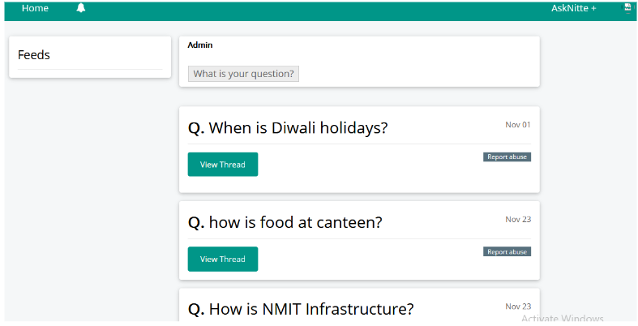

# AskNitte

A question-and-answer forum built for college communities — think Quora, but for your campus.



---

## What is it?

AskNitte lets students at NITTE ask questions, share answers, and build a knowledge base specific to their community. It was built because college communities have questions that Quora can't answer — course advice, campus life, local resources — and those answers are best crowdsourced from people who've actually been there.

---

## Features

- Post questions to the community
- Answer questions from other students
- User signup and authentication
- Clean, familiar Q&A interface

> This is a working prototype. More features are in progress.

---

## Tech Stack

| Layer | Technology |
|---|---|
| Backend | PHP |
| Database | MySQL |
| Local server | WAMP (Windows Apache MySQL PHP) |

---

## Running Locally

**Prerequisites:** [WAMP](https://www.wampserver.com/) installed on Windows.

1. Clone the repo
   ```bash
   git clone https://github.com/ightdragon/AskNitte.git
   ```

2. Move the project folder into your WAMP `www` directory
   ```
   C:/wamp/www/AskNitte/
   ```

3. Start WAMP and make sure Apache and MySQL are running (both indicators green in the tray icon)

4. Open your browser and navigate to
   ```
   http://localhost/AskNitte/asknitte_signuptest/
   ```

5. Set up the database — import the SQL file via phpMyAdmin at `http://localhost/phpmyadmin`

> **Note:** Database credentials are configured in the project's config/connection file. Update them to match your local WAMP setup if needed.

---

## Project Structure

```
AskNitte/
├── asknitte_signuptest/   # Main application (signup, login, Q&A views)
├── AskNitte.PNG           # Screenshot
└── README.md
```

---

## Contributing

Pull requests are welcome. If you're a NITTE student and want to add features, fix bugs, or improve the UI — go ahead and open a PR or raise an issue.

---

## Author

Built by [Tejaswi K](https://github.com/ightdragon)
